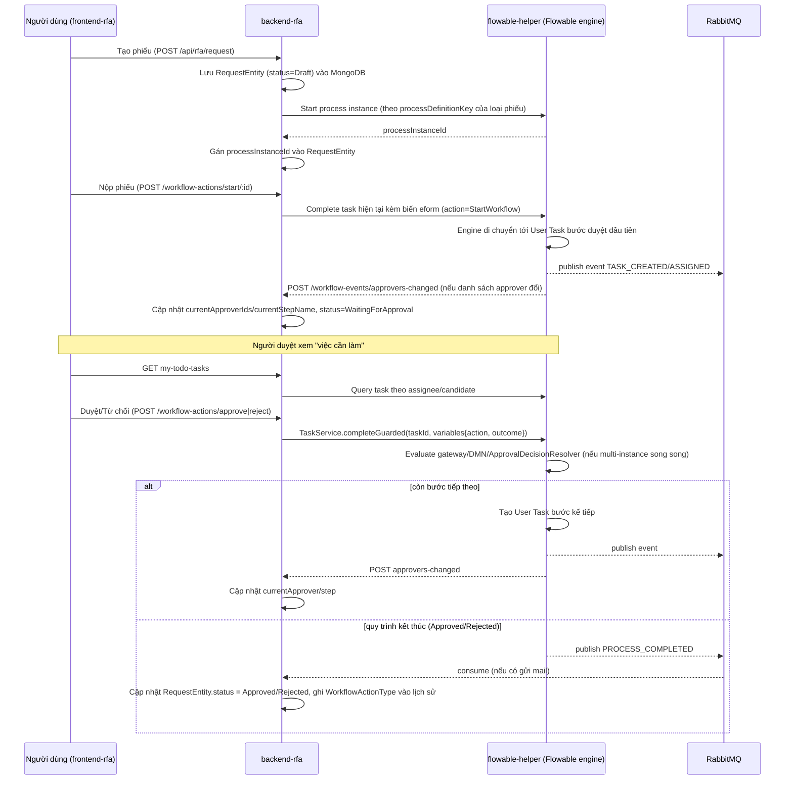

# Tổng quan hệ thống Quy trình Phê duyệt (RFA) & Flowable — v5

> Tài liệu tổng hợp từ việc đọc code 3 project: `backend-java-flowable`, `backend-rfa`, `backend-workflow`.
> Mục đích: nắm được ý tưởng thiết kế, Flowable dùng ra sao, data lưu ở đâu, flow chạy như nào, và các project liên kết với nhau ra sao.

---

## ⚠️ Đính chính — toàn bộ nội dung bên dưới nói về project KHÁC, KHÔNG PHẢI kiến trúc thực tế ở đây

Toàn bộ phần còn lại của tài liệu này là bản tóm tắt project **`D:\project\company\v5`** (`backend-java-flowable`/"flowable-helper", `backend-rfa`, `backend-workflow`) — một hệ thống khác, dùng làm tài liệu tham khảo kiến trúc lúc thiết kế ban đầu. Nó **không mô tả** cách `backend-mikroorm` / `D:\project\home\flowable` / `frontend-mikroorm` thực sự tích hợp với nhau. Giữ lại phần dưới chỉ để tham khảo lịch sử.

**Kiến trúc thực tế** (đã implement) theo đúng tài liệu gốc `D:\project\home\flowable\approval-flowable-nestjs-react-docs.md` — đó mới là spec đúng cho 3 project trong `D:\project\home`:

- **`D:\project\home\flowable`** — Spring Boot dùng thẳng **stock Flowable REST starter** (`flowable-spring-boot-starter-rest`), port **8080**, context path `/flowable-rest/service`. Không có facade tùy biến, không có `decisionRules`. Java chỉ có 1 lớp mỏng thêm vào: `WorkflowFinalizeDelegate` (bean `workflowFinalizeDelegate`) — service task cuối BPMN gọi ngược NestJS.
- **`backend-mikroorm`** (`libs/core/modules/flowable/flowable.service.ts`) — gọi thẳng REST API gốc của Flowable bằng **HTTP Basic Auth** (`FLOWABLE_SVC_USER`/`FLOWABLE_SVC_PASSWORD`, không phải OIDC/forward token). Endpoint thật: `POST /runtime/process-instances`, `POST /runtime/tasks/{id}` (body `{action:"complete"|"claim", variables:[{name,value}]}`), `GET /history/historic-process-instances/{id}`, `POST /repository/deployments`. Không có `ApiResponse<T>` wrapper, không có ratio/decisionRules — chỉ 1 biến `decision` phẳng (`APPROVE`/`REJECT`/`RETURN`), gateway trong BPMN tự đọc biến này.
  - `libs/app/services/workflow-actions/workflow-actions.service.ts` — start/approve/reject/return/cancel, đồng bộ task bằng polling (`syncTasksFromFlowable`) thay vì webhook/TaskListener (đơn giản hơn vì approver được NestJS resolve sẵn trước khi start process, đúng "cách 1 — resolve trước khi start" mà tài liệu flowable khuyến nghị làm mặc định).
  - `libs/app/controllers/workflow-callback/workflow-callback.controller.ts` — `POST /internal/workflow/finalize`, bảo vệ bằng `InternalAuthGuard` (`X-Internal-Auth` so khớp `INTERNAL_SERVICE_TOKEN`) — được `workflowFinalizeDelegate` gọi khi BPMN process kết thúc, đóng trạng thái `WorkflowInstanceEntity` (Approved/Rejected/Returned).
- **`frontend-mikroorm`** — nơi **sinh BPMN XML** (`src/utils/bpmn/generate-workflow-bpmn.ts`), y hệt vai trò của `frontend-rfa` bên v5 (backend không tự sinh BPMN). Sinh từ graph node/edge của `workflow-setting` (Start → Approval(s) → End), theo dạng chuỗi tuần tự (bỏ qua rẽ nhánh theo `WfEdge.condition` ở lần base này). Nút "Deploy" trong trang Workflow Setting build XML tại client rồi upload qua `POST /workflow-setting/:id/deploy`. Có thêm trang `workflow-instance` (tạo/nộp phiếu) và `my-tasks` (duyệt/từ chối/trả lại).

**Các đơn giản hoá đã ghi nhận cho lần "base" này** (chưa làm, không phải làm sai):
- Chỉ hỗ trợ chuỗi duyệt tuần tự; điều kiện rẽ nhánh theo dữ liệu nghiệp vụ (`WfEdge.condition`) chưa được BPMN generator dùng tới.
- Approver chỉ resolve cho `ApproverType.User`; `Dept`/`Role`/`Dynamic` chưa resolve thành danh sách thành viên.
- Không có delegation/RFI/review-subtask/multi-round như v5 — chỉ 5 action cơ bản: start/approve/reject/return/cancel.

---

## 1. Ba project và vai trò

| Project | Công nghệ | Port | Vai trò |
|---|---|---|---|
| **backend-java-flowable** (`flowable-helper`) | Java 21, Spring Boot 2.7.18, Flowable 6.8.0, Maven | 8091 | **"Phase 1"** — helper/adapter bọc BPM engine Flowable, expose REST API. **Không chứa business logic, không xác thực (auth)** — chỉ vận hành engine. |
| **backend-rfa** | NestJS + Nx monorepo, MongoDB/MikroORM, pnpm | 28291 | **"Phase 2"** — layer nghiệp vụ chính: sở hữu dữ liệu "phiếu đề nghị" (request), toàn bộ logic phê duyệt (approve/reject/return/cancel/skip/delegate...), API cho frontend. Đây là service **điều phối** gọi vào flowable-helper. |
| **backend-workflow** (`bpmn-workflow-bridge`) | NestJS + Nx monorepo, MongoDB/MikroORM | 28299 | Ban đầu là app **ECM** (quản lý hồ sơ tài liệu — "hồ sơ", "phiếu mượn tài liệu", kho lưu trữ...) đời cũ, sau đó được gắn thêm một lớp **bridge sang Flowable REST API gốc** (không qua flowable-helper). Vai trò trong flow RFA hiện tại **không rõ ràng/chưa được wire đầy đủ** (xem mục 6). |

Domain field ("RFA" = **Request For Approval** = phiếu đề nghị phê duyệt) — từ điển thuật ngữ chính (theo `CLAUDE.md` của flowable-helper):

| Tiếng Việt | Nghĩa kỹ thuật |
|---|---|
| Phiếu đề nghị / Đề nghị phê duyệt | Process instance trong Flowable |
| Quy trình duyệt | Process definition (file BPMN đã deploy) |
| Bước duyệt / Nhiệm vụ | User task đang active |
| Người duyệt | Task assignee / candidate user-group |
| Kết quả duyệt | Biến process `outcome` / `approvalResult` / `decision` |
| Lịch sử duyệt | Dữ liệu `ACT_HI_*` trong PostgreSQL |

---

## 2. Kiến trúc & liên kết giữa 3 project

```mermaid
flowchart TB
    FE["frontend-rfa (React)"]

    subgraph RFA["backend-rfa (NestJS) — port 28291"]
        RFAAPI["libs/rfa — Request/Workflow domain logic"]
        RFAJobs["jobs/rfa-jobs — cron: auto-cancel, overdue, reminder mail..."]
        RFAMongo[("MongoDB riêng của RFA\nrequests, workflows, workflow-tasks,...")]
    end

    subgraph FLW["backend-java-flowable (\"flowable-helper\") — port 8091"]
        FLWAPI["Spring controllers: process / task / deployment / dmn / form / history / identity / stats / event"]
        PG[("PostgreSQL 15\nACT_RE_* / ACT_RU_* / ACT_HI_*\n(schema gốc của Flowable engine)")]
        FLWMongo[("MongoDB `rfav5`\ncollections: users, groups\n(identity — thay ACT_ID_*)")]
    end

    MQ[("RabbitMQ")]

    subgraph WF["backend-workflow (\"bpmn-workflow-bridge\") — port 28299"]
        WFAPI["libs/workflow — proxy 1:1 sang Flowable REST API GỐC (port 8080)"]
        WFJobs["jobs/ecm-jobs — cron dọn hồ sơ hết hạn, sync quyền eform"]
        ECMMongo[("MongoDB dùng chung cluster\n(hồ sơ tài liệu ECM + cả rfaEntities)")]
    end

    FlowableRest["Flowable REST gốc (OOTB, port 8080)\n— KHÔNG phải flowable-helper"]

    FE -->|"REST /api/rfa/*"| RFAAPI
    RFAAPI -->|"HTTP, env BACKEND_WORKFLOW_URL\n(tên biến gây nhầm — trỏ thẳng vào flowable-helper)"| FLWAPI
    RFAAPI --- RFAMongo
    RFAJobs --- RFAAPI

    FLWAPI --- PG
    FLWAPI --- FLWMongo
    FLWAPI -->|"publish task/process events"| MQ
    MQ -->|"consume: gửi mail (ActionRabbitMq.SendMail)"| RFAAPI
    FLWAPI -->|"HTTP POST /workflow-events/approvers-changed\n(OIDC service token, sau khi commit)"| RFAAPI

    WFAPI -->|"HTTP (native Flowable REST, base URL khác 8091)"| FlowableRest
    WFAPI -->|"HTTP qua URL cấu hình trong AppSetting\n(API_APPROVE_RFA_BY_WORKFLOW,...)"| RFAAPI
    FlowableRest -.->|"webhook: task-created/completed/assigned...\n(hiện chỉ log, CHƯA xử lý nghiệp vụ)"| WFAPI
    WFAPI --- ECMMongo
    WFJobs --- WFAPI
```

**Đường đi chính (đang chạy thật, theo `CLAUDE.md` của flowable-helper):**

```
frontend-rfa → backend-rfa → flowable-helper (backend-java-flowable)
```

`backend-workflow` **không nằm trên đường đi chính này** trong code hiện tại — nó gọi thẳng vào REST API gốc của Flowable (cổng 8080, khác hẳn API tùy biến của flowable-helper trên 8091), và có một đường tích hợp HTTP riêng, kiểu cũ, gọi sang `backend-rfa` qua URL cấu hình trong AppSettings (`API_APPROVE_RFA_BY_WORKFLOW`, `API_CANCEL_RFA_BY_WORKFLOW`, `API_REJECT_RFA_BY_WORKFLOW`...). Xem mục 6 để biết chi tiết điểm mơ hồ này.

---

## 3. Flowable dùng như thế nào

- **Không deploy sẵn BPMN**: `backend-java-flowable` không đóng gói file `.bpmn20.xml` nào trong `src/main/resources` (chỉ có file test ở `src/test/resources/processes/`). Quy trình (BPMN) được **deploy động lúc runtime** qua API `POST /deployments`.
- Engine dùng gần như nguyên bản Flowable (`RepositoryService`, `RuntimeService`, `TaskService`, `HistoryService`, `FormService`, `DmnRepositoryService`), **không tự ý sửa schema**: `flowable.database-schema-update: false` — schema phải được tạo sẵn từ trước, không auto-migrate ở production.
- **Identity (user/group) không dùng Postgres `ACT_ID_*` mặc định** — bị override bằng `FlowableIdentityConfig.installMongoIdentityManagers()`, chuyển sang đọc từ MongoDB (`rfav5.users`, `rfav5.groups`). Service này **chỉ đọc** — mọi ghi user/group phải qua `backend-rfa`. `checkPassword()` luôn trả `true` vì auth thật do backend-rfa xử lý.
- **Extension nghiệp vụ chạy ngay trong BPMN** (Java delegate/listener), đáng chú ý:
  - `ApprovalDecisionResolverDelegate` — parallel multi-instance (nhiều người duyệt cùng lúc), quyết định outcome **data-driven** qua `decisionRules` (terminate sớm, tỉ lệ yêu cầu tối thiểu, ưu tiên...) thay vì hard-code.
  - `SingleAssigneeListener` / dynamic assignee resolver — tính người duyệt động (theo phòng ban, group) bằng cách **gọi ngược lại backend-rfa**.
  - `PendingGuard` (RFI 3-mode) — chặn task khi có "yêu cầu bổ sung thông tin".
  - `ReviewSubtaskService` — tạo task con "soát xét" gắn với task duyệt chính qua `parentTaskId`.
  - `HttpCallDelegate` / `RabbitMqPublishDelegate` — cho phép BPMN tự gọi HTTP ra ngoài hoặc bắn message lên RabbitMQ ngay trong luồng xử lý.
  - DMN (Drools/KIE) dùng cho `businessRuleTask` — bảng quyết định nghiệp vụ.
- **Sự kiện task** (`create`/`assign`/`complete`) được khai báo thẳng trong BPMN XML (`<flowable:taskListener ref="bpmTaskEventListener" .../>`), bắt bởi `BpmTaskEventListener` → publish Spring event nội bộ → fan-out sang: log audit, RabbitMQ, và (khi approver thay đổi) HTTP callback tới backend-rfa.

---

## 4. Data lưu ở đâu

| Loại dữ liệu | Lưu ở đâu | Ai sở hữu / ghi |
|---|---|---|
| Process definition, process instance, task đang chạy | **PostgreSQL 15** — bảng gốc Flowable `ACT_RE_*` (repository), `ACT_RU_*` (runtime) | `flowable-helper` (Flowable engine tự quản lý schema) |
| Lịch sử process/task (audit trail của engine) | **PostgreSQL** — `ACT_HI_*` | `flowable-helper` |
| DMN decision table | PostgreSQL (schema DMN của Flowable) | `flowable-helper` |
| User / Group cho Flowable identity | **MongoDB `rfav5`**, collection `users`, `groups` | `flowable-helper` chỉ đọc; **ghi qua `backend-rfa`** |
| **Phiếu đề nghị (request)**, workflow instance, workflow-task, workflow-setting, request-type, e-form, attachment, comment,... | **MongoDB riêng của backend-rfa** (MikroORM, per-request context, `allowGlobalContext:false`) | `backend-rfa` — đây là nguồn dữ liệu nghiệp vụ chính, KHÔNG nằm trong Flowable |
| Hồ sơ tài liệu (ECM: `HoSoTaiLieuTT`, `CauTrucHoSoTT`, phiếu mượn tài liệu, kho lưu trữ...) | MongoDB (cluster dùng chung — app này còn nạp cả `rfaEntities` vào cùng context) | `backend-workflow` (phần ECM legacy) |
| Async event / lệnh gửi mail | **RabbitMQ** (exchange/queue cấu hình `app.delegate.rabbitmq.*`, `rabbitmq_bpm_delegate_*`) | Publish: `flowable-helper` — Consume xác nhận được: `backend-rfa` (`RabbitMQRFAService` xử lý `ActionRabbitMq.SendMail`) |

**Điểm quan trọng**: Flowable engine (Postgres) chỉ giữ **trạng thái vận hành của luồng BPMN** (ai đang giữ task nào, task nào đã xong, biến process). **Toàn bộ dữ liệu nghiệp vụ "phiếu"** — nội dung, người tạo, loại phiếu, trạng thái hiển thị cho người dùng, lịch sử hành động — nằm ở MongoDB của `backend-rfa` (`RequestEntity`, `WorkflowEntity`, `WorkflowTaskEntity`). Hai bên được liên kết qua `RequestEntity.processInstanceId` / `processDefinitionKey`.

Để tránh phải hỏi Flowable liên tục khi liệt kê/lọc danh sách phiếu, `backend-rfa` **denormalize** sẵn `currentApproverIds`, `currentStepName`, `currentStepStartDate` ngay trên `RequestEntity`, được một service riêng (`CurrentApproverProjectionService`) cập nhật mỗi khi nhận event approver-thay-đổi từ Flowable.

---

## 5. Flow chạy của một phiếu đề nghị (happy path)



**Các cơ chế đặc biệt trong flow (đáng chú ý khi đọc code)**:
- **Duyệt song song (parallel multi-instance approvers)**: 1 bước có nhiều người duyệt cùng lúc; kết quả bước được `ApprovalDecisionResolverDelegate` tính theo `decisionRules` (bao nhiêu % đồng ý thì qua, có dừng sớm khi bị từ chối không...).
- **Thêm/xoá bước duyệt runtime**: `backend-rfa` có thể gọi `POST /process-instances/{id}/multi-instance/add|remove` trên flowable-helper để tiêm thêm approver vào một multi-instance sub-process **đang chạy** mà không cần vẽ lại BPMN (xem `.agents/plans/dynamic-approver-steps.md`).
- **RFI — yêu cầu bổ sung thông tin (3-mode pending guard)**: có thể tạm khoá một task cho tới khi thoả điều kiện.
- **Soát xét (review subtask)**: tạo task con gắn với task duyệt chính, không làm thay đổi luồng chính.
- **Nhắc hạn / tự động huỷ**: `jobs/rfa-jobs` chạy cron riêng (không qua Flowable) để tự huỷ phiếu quá hạn, tự skip task quá hạn, gửi mail nhắc — thao tác trực tiếp lên `WorkflowTaskEntity`/`RequestEntity` và cũng gọi lại các service workflow tương tự flow thủ công.

---

## 6. Điểm chưa rõ ràng / rủi ro cần lưu ý

1. **`backend-workflow` có 2 vai trò chồng léo nhau, dường như chưa được dọn dẹp**:
   - (a) **ECM legacy** (`libs/workflow/src/consts`, `jobs/ecm-jobs`) — quản lý hồ sơ/tài liệu, không liên quan Flowable, vẫn có cron job riêng và **gọi thẳng sang `backend-rfa`** qua URL cấu hình trong AppSettings (`API_APPROVE_RFA_BY_WORKFLOW`, `API_CANCEL_RFA_BY_WORKFLOW`, `API_REJECT_RFA_BY_WORKFLOW`) — một đường tích hợp **độc lập, kiểu cũ**.
   - (b) **Flowable bridge mới** (`libs/workflow/src/{process-instance,task,form,...}`) — proxy 1:1 sang REST API **gốc** của Flowable (cổng 8080, khác `flowable-helper` trên 8091) và có endpoint webhook nhận callback từ Flowable — nhưng `webhook.service.ts` **hiện chỉ log ra console, chưa xử lý nghiệp vụ thật** (chưa cập nhật gì vào `backend-rfa`).
   - → Không tìm thấy chỗ nào trong code `backend-rfa` gọi sang `backend-workflow`, và ngược lại `backend-workflow` không gọi vào `flowable-helper`. Có khả năng `backend-workflow` phục vụ một luồng/khách hàng khác (hoặc là bản nháp/di sản chưa dùng tới trong flow RFA hiện hành) — **cần hỏi lại team để xác nhận** trước khi coi đây là một phần "đang chạy" của quy trình phê duyệt chính.
2. **Tên biến môi trường gây nhầm**: `backend-rfa` dùng biến `BACKEND_WORKFLOW_URL` nhưng giá trị thực tế trỏ vào `flowable-helper` (mặc định `http://localhost:8091`) chứ không phải `backend-workflow`.
3. **Schema Postgres của Flowable không có migration trong repo** — được set `database-schema-update:false`, nghĩa là ai đó phải tạo/migrate schema này bằng công cụ riêng (Flowable tool hoặc DBA), không tự chạy khi deploy app.
4. **RabbitMQ**: `flowable-helper` publish event cho "cả backend-rfa lẫn backend-workflow" (theo tài liệu nội bộ), nhưng chỉ xác nhận được **consumer thật trong `backend-rfa`** (`RabbitMQRFAService`, xử lý gửi mail). Không tìm thấy consumer RabbitMQ nào trong `backend-workflow`.

---

## 7. Bảng endpoint liên service quan trọng

| Từ | Đến | Endpoint / cơ chế | Mục đích |
|---|---|---|---|
| backend-rfa | flowable-helper | `POST /process-instances`, `/tasks/{id}/complete`, `/tasks/{id}/claim`, `/deployments`,... | Điều khiển vòng đời process/task |
| flowable-helper | backend-rfa | `POST /workflow-events/approvers-changed` (OIDC client-credentials, sau commit) | Báo danh sách người duyệt hiện tại đổi |
| flowable-helper | RabbitMQ | publish `BpmTaskEventMessage` | Event bất đồng bộ (audit, mail,...) |
| RabbitMQ | backend-rfa | consume `ActionRabbitMq.SendMail` | Gửi mail theo template khi có sự kiện BPM |
| flowable-helper (delegate trong BPMN) | backend-rfa | `AssigneeResolverService` (resolve approver động) | Tính người duyệt theo phòng ban/nhóm lúc runtime |
| backend-workflow | Flowable REST gốc (8080) | proxy toàn bộ `process-definition/instance/task/form/...` | Bridge độc lập, không qua flowable-helper |
| backend-workflow | backend-rfa | HTTP theo URL cấu hình trong AppSettings | Tích hợp kiểu cũ (approve/reject/cancel RFA từ phía ECM) |

---

## Tài liệu tham khảo nội bộ (đáng đọc thêm nếu cần đào sâu)

- `backend-java-flowable/CLAUDE.md` + cây `CLAUDE.md` theo module (`event/`, `approval/`, `assignee/`, `pending/`,...) — tài liệu kiến trúc chi tiết nhất, có sơ đồ luồng dạng text cho từng module.
- `backend-rfa/.agents/plans/dynamic-approver-steps.md` — giải thích rõ nhất mô hình 3 phase (flowable engine → backend-rfa → frontend-rfa) và cách tiêm thêm bước duyệt runtime.
- `backend-rfa/.agents/plans/{parallel-mi-approvers,mi-assignee-resolver,rfi-3-mode-pending,request-review-subtask}.md` — thiết kế các cơ chế đặc biệt.
- `backend-rfa/CLAUDE.md` — quy ước code, cấu trúc monorepo Nx.
